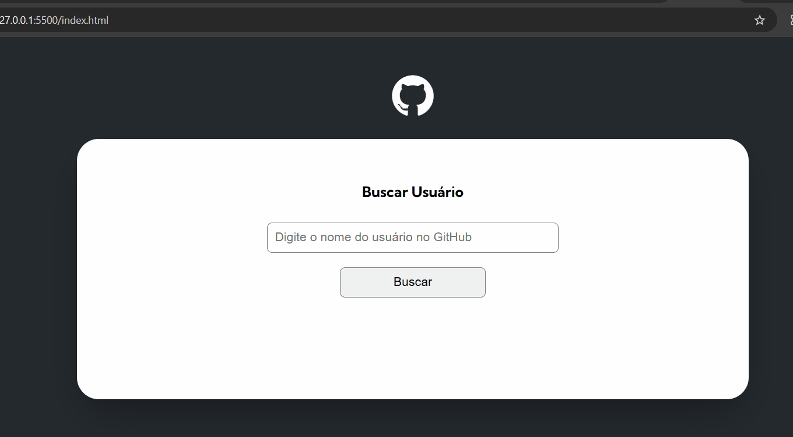
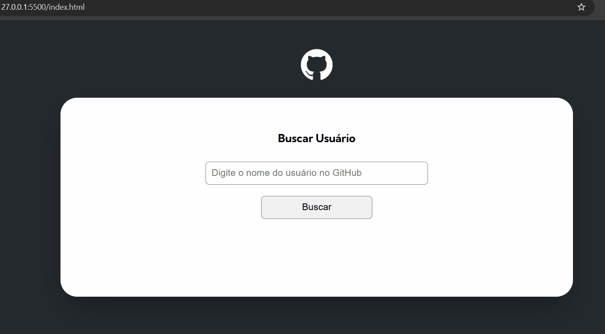
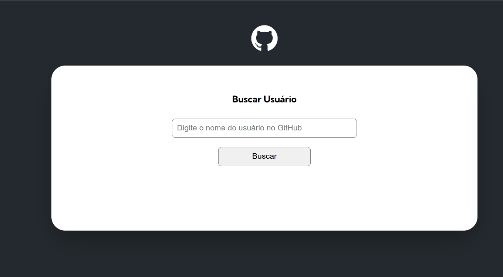

<h1 align="center">Buscando com API do GitHub</h1>

Tabela de conteúdos
=================

   * Sobre o projeto
   * Tecnologias
   * Layout 
## Sobre o Projeto

Bem seguindo os módulos do curso <a href=https://www.linkedin.com/company/dev-em-dobro/posts/?feedView=all target="_blank">DevQuest Full-Stack</a>, no módulo Javascript Avançado, o Exercício consiste basicamente em realizar buscas, pesquisas por usuário, e seus repositórios do <a href=https://github.com target="_blank">GitHub</a>. Foi realizado configurações no código limitando a quantidade de resultados quanto ao numero de repositório, nesse caso, a busca só traria 10(dez) ao todo de repositórios. Ao realizar a pesquisa o campo de busca deverá ser preenchido, caso não o fizer, receberá um ALERTA na tela, salientando essa necessidade, mesmo porque se tratando de uma campo de pesquisa, deixá-lo vazio é algo disperso. Porém para se evitar esse tipo de situção foi realizado tal configuração no código, assim como também pesquisas com nomes incorretos de usuário, ou até mesmo pode ter ocorrido algum erro ao digitar, quem estiver pesquisando será informado, podendo corrigir, se isso for possível e tentar realizar a pequisa novamente. O intuito sem dúvida com esse Exercício foi trazer um pouco do mundo real com Fetch e GitHub propriamente dito. O layout da página também, foi configurado para que fique ideal independendo do tamanho da tela do dispositivo, para uma melhor experiência do usuário .
 

## 🛠 Tecnologias utilizadas

 
 

## 🎨 Layout

## Ao acinar o botão de Buscar sem digitar nada

## Acionando a tecla "enter" sem digitar nada

## Ao digitar incorretamente.

## Corrigindo.

## Navegando pela Aplicação.

Para uma melhor experiência acessem:
      <a  href=https://carvalhorp2022.github.io/buscando-api-no-github/ target="_blank">Buscar com API</a>

